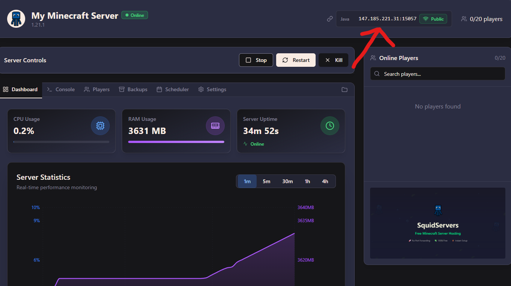

# 🌐 Using a Custom Domain

## Step 1:  Buy a Domain

This can be done via any site like Namecheap, GoDaddy, Cloudflare, or Porkbun.

> Need help?&#x20;
>
> Video tutorial here: [https://www.youtube.com/watch?v=j1ykFm7blXk](https://www.youtube.com/watch?v=j1ykFm7blXk)

## Step 2: Locate Server's IP and Port

When you have a server open the dashboard and look in the top right to view the minecraft server's address.

<figure><figcaption></figcaption></figure>

The text on the left of the `:` is the `IP address` and the text on the right is the `port`&#x20;

So for our screenshot above we get the following values:

| Name        | Value                                                         |
| ----------- | ------------------------------------------------------------- |
| IP address  | 147.185.221.31                                                |
| Port        | 15057                                                         |
| Sub-domain  | minecraft-server (replace with what you want or leave blank)  |
| Base-domain | squidservers.com (replace with your actual domain you bought) |

## Step 3: Create a DNS A Record

Now that we have our values we need to create an A record that points a subdomain (or root domain) to your server's IP address. This is the hostname that your SRV record will target.

1. Log in to your domain's DNS management panel.
2. Navigate to the section for adding or managing DNS records.
3. Add a new record with the following settings:
   * Type: `A`
   * Host/Name: `minecraft-server`  or leave `blank/use default` value for no subdomain
     * No subdomain means the domain `squidservers.com` will resolve to your server instead of `minecraft-server.squidservers.com`
   * Value/Points to: `your-ip-address` (in our example we would put `147.185.221.31`)
   * TTL: `600` or use the `default`  &#x20;

After this record is saved, the hostname `minecraft-server.squidservers.com` will successfully resolve to the server's IP address.

## Step 4: Create a DNS SRV Record

Next, you will create an SRV record. This record tells the Minecraft game launcher to use a specific port when connecting to the hostname you just created.

1. Navigate back to your DNS management panel.
2. Add a new record with the following settings:
   * Type: `SRV - Service record`
   * Host: `_minecraft._tcp.minecraft-server` or just `_minecraft._tcp` if you are doing no subdomain
     * `_minecraft` is the service type.
     * `_tcp` is the protocol.
     * `your-sub-domain-name-here` is the subdomain you created in Step 1.
   * Answer / Value: `0 1 15057 minecraft-server.squidservers.com.`
     * `0`: Priority (Lower numbers have higher priority.)
     * `1`: Weight (Used for load balancing.)
     * `15057`: Port Number (The port of your Minecraft server.)&#x20;
       * **REPLACE WITH YOUR ACTUAL PORT VALUE**
     * `minecraft-server.squidservers.com.`: Target (The hostname you created in Step 1. Don't forget the `.` at the end!)
       * we got this value by doing `sub-domain.base-domain`
   * TTL: `600` or use the `default`

## **Step 5: Test Your Connection**

Now use this site to check if it worked: [https://mcstatus.io/](https://mcstatus.io/)

If it's successful it should look like the image below

<figure><figcaption></figcaption></figure>


