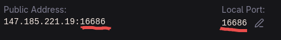

# 🎤 How to Use Voice Chat Mod in SquidServer

_Author: Yunus Emre_

## 1. Install PaperMC & Simple Voice Chat

- Download and set up a Minecraft server using PaperMC (a high-performance fork of Spigot).

- Add the Simple Voice Chat plugin by placing it into the plugins folder of your server.
  > (If you’re using Fabric/Forge instead, place the mod in the mods folder.)

## 2. Create Tunnels with SquidServer

- Open the SquidServer dashboard and create a bedrock tunnel for voice chat traffic
- Copy down the domain and port assigned
- Update the local port to match the port of the public address (in this photo example it's 16686)

<figure><figcaption>
Make sure the underlined values are equal
</figcaption></figure>

## 3. Configure Voice Chat Properties

- In your server directory, locate and open voicechat-server.properties (inside config/voicechat or plugins/voicechat).
- Edit these lines:
  - voice_host= → set to the domain of your Bedrock tunnel (without the port).
  - port= → set to the port number from the Bedrock tunnel.
- Save and close the file.

## 4. Launch the Server & Tunnels

- Start your Minecraft server normally.
- Run both the Java tunnel and the Bedrock tunnel at the same time.
- If configured correctly, the console will show something like:

> `[VoiceChatServerThread/INFO]: Server started at port XXXX`

## 5. Connect & Test Voice Chat

- Players join using the Java tunnel address from SquidServer.
- In-game, press V to open the Voice Chat settings.
- Test with another player to confirm that proximity chat works — voices will fade in/out based on distance.
